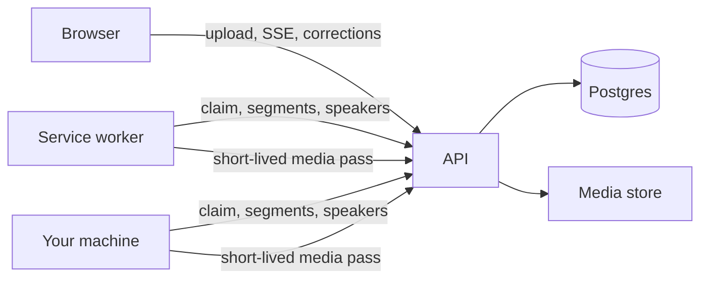

# WisperPlatform wiki

Self-hosted transcription with live output, browser correction, diarisation and exports. This wiki
is for people who want to **run** it, **lend compute** to it, or **change** it.

Start with the [README](https://github.com/Nathandelenclos/WisperPlatform#readme) for what the
product is. This wiki covers what happens after you decide to use it.

## Pages

| Page | Read it when |
|---|---|
| [Self-hosting](Self-hosting) | You are deploying an instance: environment, secrets, reverse proxy, migrations, backups, upgrades. |
| [Workers and machines](Workers-and-machines) | You want to add transcription capacity, from a spare PC or a GPU box, or let your users bring their own. |
| [Diarisation](Diarisation) | You want speaker labels, or you want to tune how many speakers get detected. |
| [Google sign-in](Google-sign-in) | You want users to sign in with Google instead of a password. |
| [Troubleshooting](Troubleshooting) | Something is stuck, silent, or lying to you. Every entry here is a failure that actually happened. |
| [Architecture decisions](Architecture-decisions) | You are changing the code and want to know why it is shaped this way, with the numbers behind each call. |
| [Contributing](Contributing) | You are sending a patch: how to run everything, and the conventions the CI enforces. |

## The shape of the thing, in one picture

A worker never talks to the database, never sees a user, and holds a media file only for the
duration of one job. The API is the only thing that knows who owns what.

## Conventions of this wiki

Numbers come with the machine they were measured on. Anything not measured says so.
